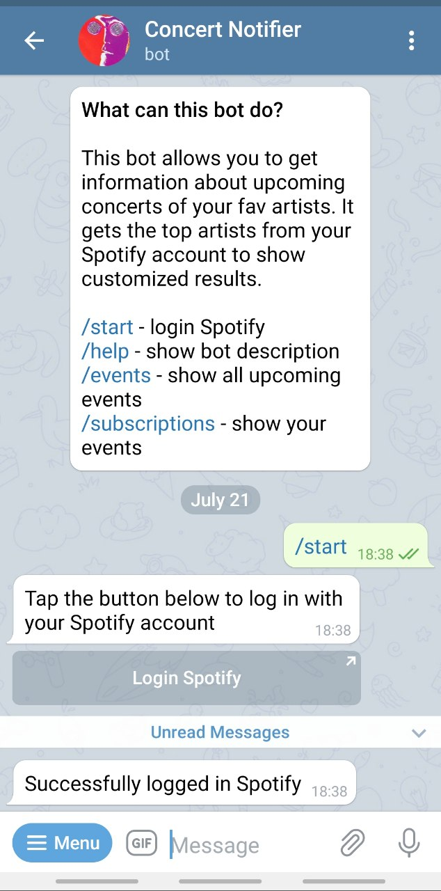
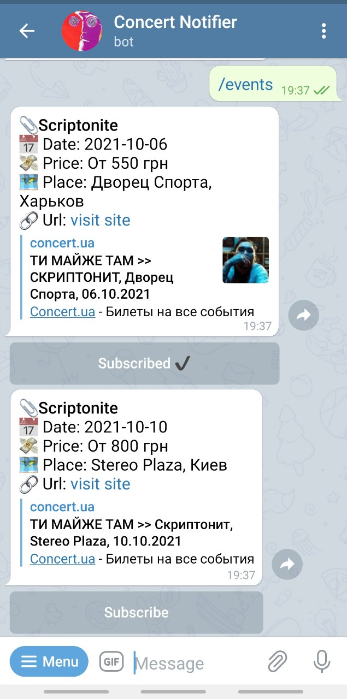
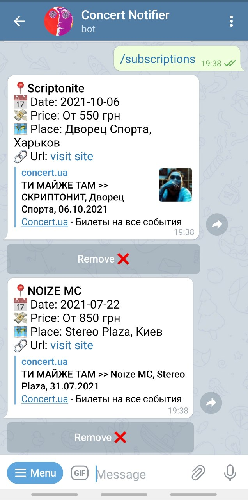
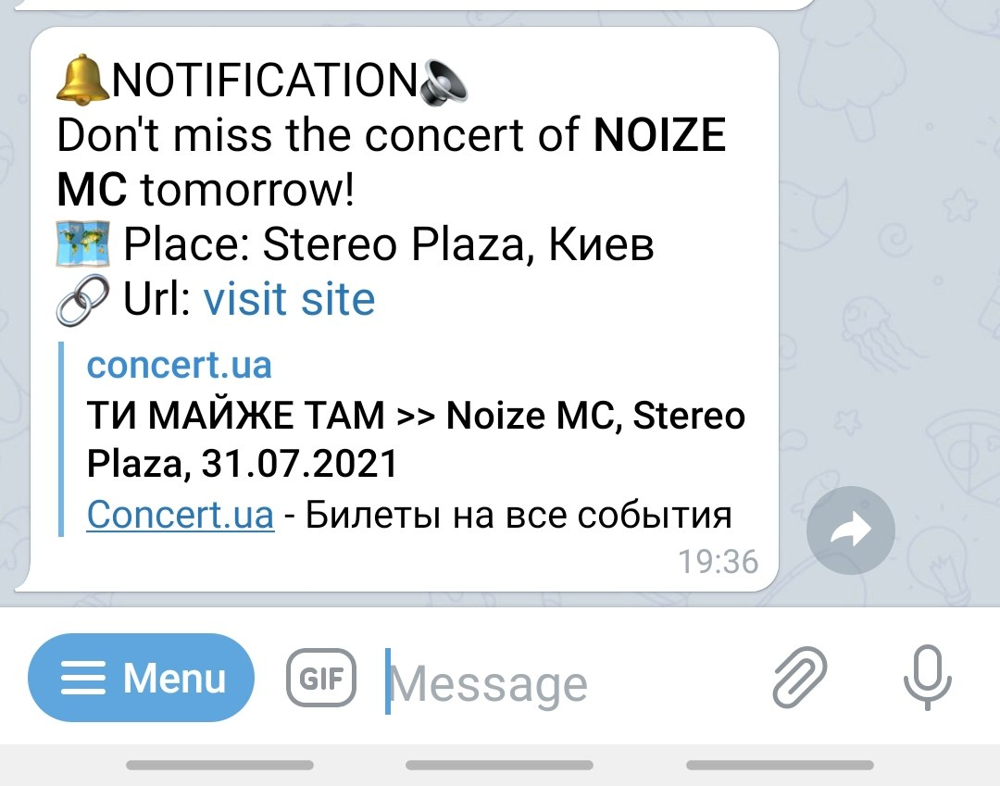
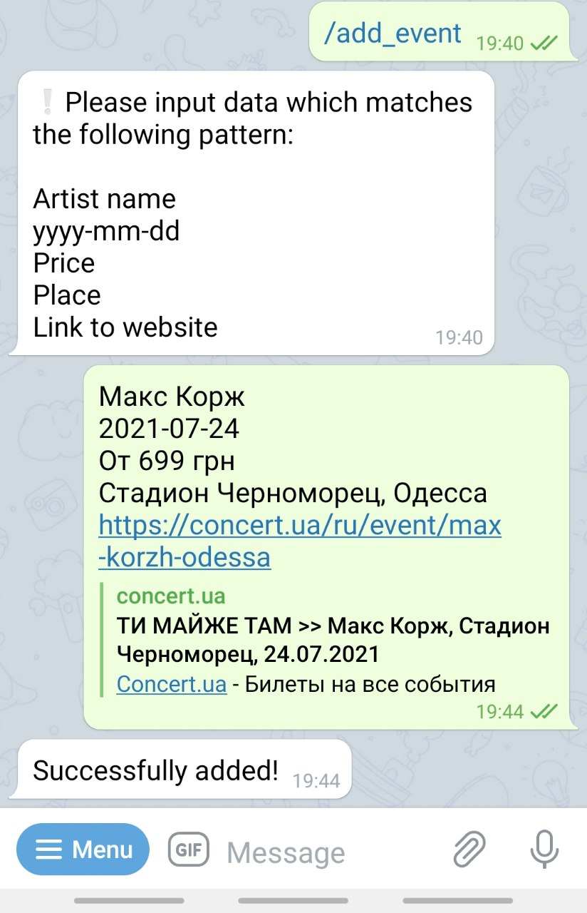

## Telegram @ConcertNotifier_Bot

##### Uses Spotify Api to get user's top artists and search for their concerts in database
##### Allows user:
- login Spotify
- search for relevant events
- subscribe/unsubscribe to concert
- receive a notification one day before the concert to which user is subscribed

##### Allows admin to add concert to DB via bot. It is possible for user to become admin only by contacting the owner.
##### Several screenshots are attached below:
1. Start and login Spotify account      
2. Search for concerts based on user's spotify top artists (top 5 artists, term - 1 month)      
3. Show users subscriptions      
4. Notification about concert to which user is subscribed      
5. Feature for __admins__, adding concert to db      
